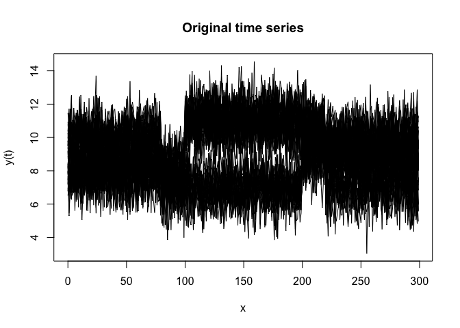
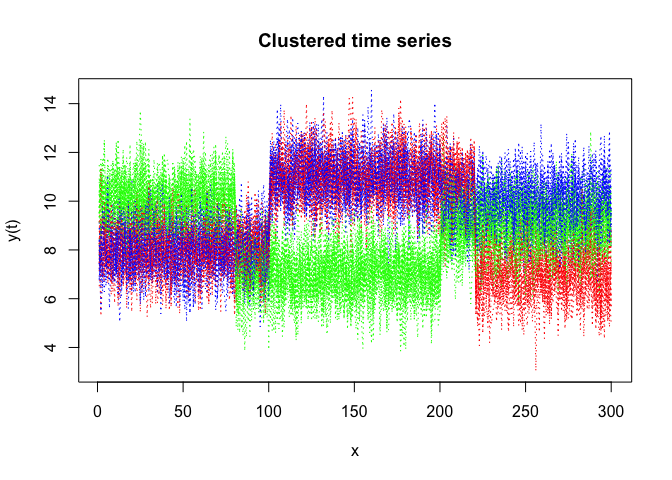
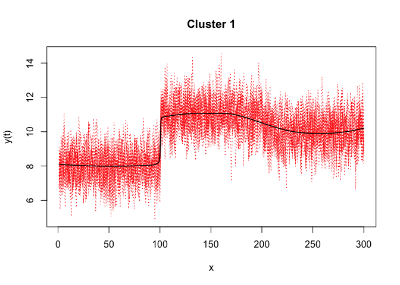
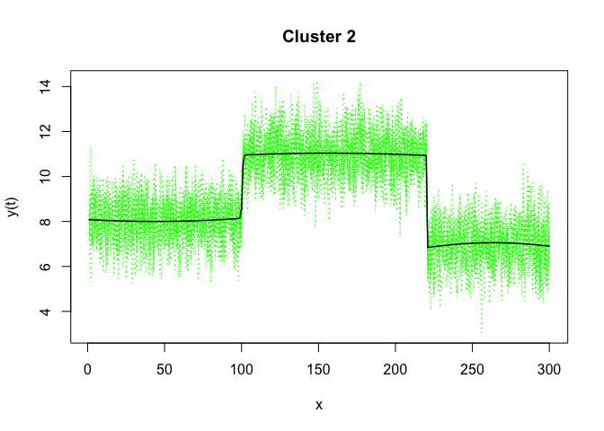
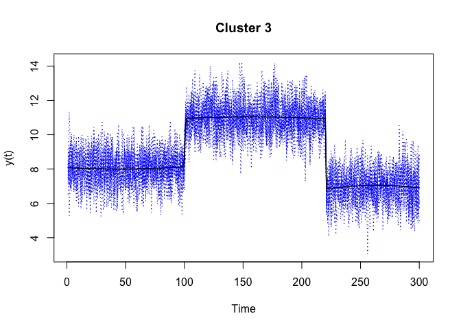

<!-- README.md is generated from README.Rmd. Please edit that file -->

## Overview

<!-- badges: start -->

<!-- badges: end -->

R code for the **clustering** and **segmentation** of time series
(including with regime changes) by mixture of gaussian Hidden Markov
Models Regression (MixHMMR) and the EM algorithm; i.e functional data
clustering and segmentation

## Installation

You can install the development version of mixHMMR from
[GitHub](https://github.com/) with:

``` r
# install.packages("devtools")
devtools::install_github("fchamroukhi/mixHMMR")
```

To build *vignettes* for examples of usage, type the command below
instead:

``` r
# install.packages("devtools")
devtools::install_github("fchamroukhi/mixHMMR", 
                         build_opts = c("--no-resave-data", "--no-manual"), 
                         build_vignettes = TRUE)
```

Use the following command to display vignettes:

``` r
browseVignettes("mixHMMR")
```

## Usage

``` r
library(mixHMMR)

data("simulatedtimeseries")
fData <- FData$new()
fData$setData(simulatedtimeseries$X, t(simulatedtimeseries[, 2:ncol(simulatedtimeseries)]))

K <- 3 # number of clusters
R <- 3 # number of regimes/states
p <- 2 # degree of the polynomial regression
variance_type = variance_types$hetereskedastic
modelMixHMMR <- ModelMixHMMR(fData, K, R, p, variance_type)

ordered_states = TRUE
n_tries = 1
max_iter = 1000
init_kmeans = TRUE
threshold = 1e-6
verbose = TRUE

solution <- EM(modelMixHMMR, ordered_states, n_tries, max_iter, init_kmeans, threshold, verbose)
#> [1] "EM try n? 1"
#> [1] "EM : Iteration : 1 log-likelihood :  -27603.7693242885"
#> [1] "EM : Iteration : 2 log-likelihood :  -22464.3472396589"
#> [1] "EM : Iteration : 3 log-likelihood :  -22229.1696060833"
#> [1] "EM : Iteration : 4 log-likelihood :  -22212.3560575002"
#> [1] "EM : Iteration : 5 log-likelihood :  -22204.7382239976"
#> [1] "EM : Iteration : 6 log-likelihood :  -22192.3908663086"
#> [1] "EM : Iteration : 7 log-likelihood :  -22179.0984264533"
#> [1] "EM : Iteration : 8 log-likelihood :  -22161.3266480818"
#> [1] "EM : Iteration : 9 log-likelihood :  -22140.2069698656"
#> [1] "EM : Iteration : 10 log-likelihood :  -22118.2274362038"
#> [1] "EM : Iteration : 11 log-likelihood :  -22091.4388392804"
#> [1] "EM : Iteration : 12 log-likelihood :  -21996.798418692"
#> [1] "EM : Iteration : 13 log-likelihood :  -21866.4806541681"
#> [1] "EM : Iteration : 14 log-likelihood :  -21826.8183365824"
#> [1] "EM : Iteration : 15 log-likelihood :  -21804.0499569094"
#> [1] "EM : Iteration : 16 log-likelihood :  -21802.7361620057"
#> [1] "EM : Iteration : 17 log-likelihood :  -21802.6973948926"
#> [1] "EM : Iteration : 18 log-likelihood :  -21802.6958496405"
#> [1] "log-lik at convergence: -21802.6958496405"

solution$plot()
```


